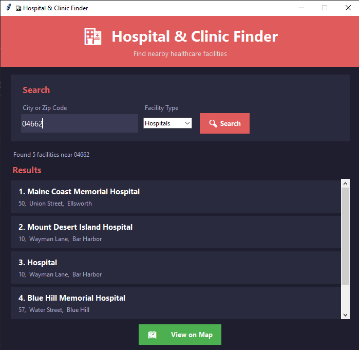
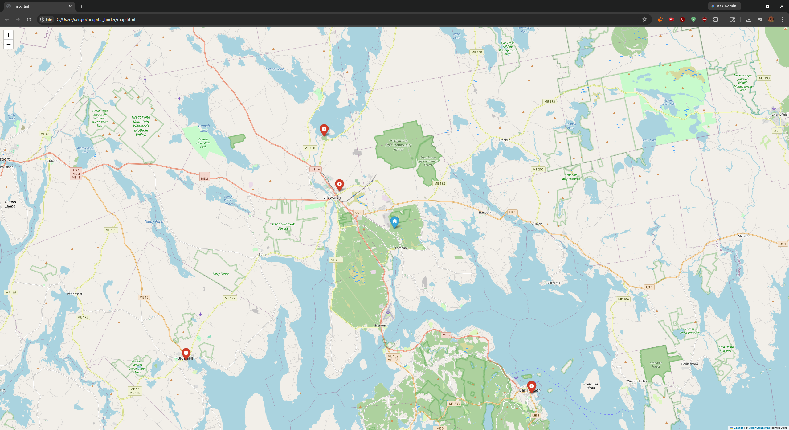

# Hospital & Clinic Finder

A desktop application for finding nearby hospitals and clinics, built with Python.




---

## Features

- **Location Search** — Search by city name or zip code
- **Facility Filter** — Filter by Hospitals, Clinics, or Both
- **Scrollable Results List** — View up to 20 nearby facilities with names and addresses
- **Interactive Map** — Opens a live map in your browser with pinned locations
- **Real-Time Data** — Powered by the OpenStreetMap / Nominatim API

---

## Tech Stack

- **Python 3.10**
- **Tkinter** — GUI framework
- **Requests** — API calls
- **Folium** — Interactive map generation
- **Nominatim API** — Free geocoding and location search (OpenStreetMap)

---

## Getting Started

### Prerequisites

- Python 3.10 or higher
- pip

### Installation

1. Clone the repository:
   ```bash
   git clone https://github.com/YOUR_USERNAME/hospital-clinic-finder.git
   cd hospital-clinic-finder
   ```

2. Install dependencies:
   ```bash
   pip install requests folium
   ```

3. Run the app:
   ```bash
   python app.py
   ```

---

## Usage

1. Enter a **city name** or **zip code** in the search box
2. Select a **facility type** — Hospitals, Clinics, or Both
3. Click **Search** to fetch nearby facilities
4. Browse the results list
5. Click **View on Map** to open an interactive map in your browser

---

## Notes

This app uses the free Nominatim/OpenStreetMap API. Results may vary based on community data coverage. A production version could integrate the Google Places API for more comprehensive and real-time results.

---

## Project Structure

```
hospital-clinic-finder/
├── app.py          # Main application
├── map.html        # Auto-generated map (opens in browser)
└── README.md
```

## License

This project is open source and available under the [MIT License](LICENSE).
